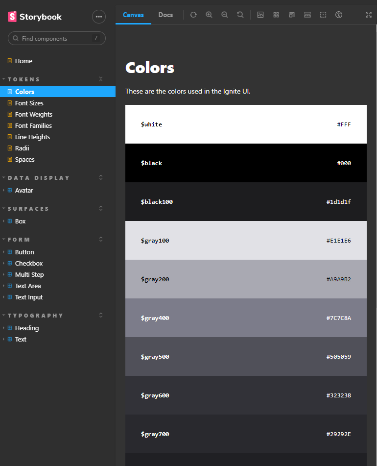

<h1 align="center">
  
Ignite UI Design System

  

    
    
    
    
    
    
  

</h1>

## ✨ Description

This is a monorepo project that contains the Ignite UI Design System packages built and released [on NPM](https://www.npmjs.com/~renatomarxs) to be installed and used in other projects.

This monorepo contains the following repositories:
-  @rmt-ignite-ui/docs
    -  The documentation displaying all the Ignite UI components with Storybook
-  @rmt-ignite-ui/react
    -  A package with the Ignite UI React components
-  @rmt-ignite-ui/tokens
    -  A package with all the tokens related to the Ignite UI Design System
-  @rmt-ignite-ui/eslint-config
    -  Linting configuration for all the packages
-  @rmt-ignite-ui/ts-config
    -  TypeScript configuration for all the packages

Developed during the "Ignite - ReactJS" bootcamp by [@Rocketseat](https://www.rocketseat.com.br).

## 🚀 Technologies
-  React
-  TypeScript
-  Monorepo / TurboRepo
-  GitHub Actions
-  CI/CD
-  Changesets
-  Stitches
-  Storybook
-  NPM publishing

## 💻 Installation

After cloning/downloading this repository, open your terminal, navigate to the project's root directory then run:

-  `npm install` - To install packages dependencies
-  `npm run dev` - To run the application on your localhost

## 🌟 Preview

